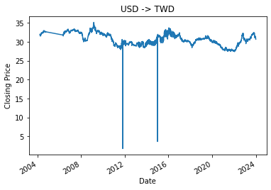

# NKUST_AI_fintech_project_II
 自專案 [NKUST_AI_fintech_project](https://github.com/Li732375/NKUST_AI_fintech_project) 延伸探索。
 ## 基本資訊
 + 目標
	+ 選用模型 XGBoost 進行美金兌台幣的漲跌預測（僅預測 漲 / 跌）
 + 資料來源
	+ 套件 yfinance
	+ 台灣消費者物價指數及其年增率 https://ws.dgbas.gov.tw/001/Upload/463/relfile/10315/2414/cpispl.xls
	+ 台灣基準利率 https://www.cbc.gov.tw/tw/public/data/a13rate.xls
+ 顯卡: NVIDIA GeForce RTX 3070 Laptop GPU
```
CMD > nvidia-smi --version

NVIDIA-SMI version  : 560.94
NVML version        : 560.94
DRIVER version      : 560.94
CUDA Version        : 12.6
```
+ 環境編輯器: Spyder IDE 5.5.5 (standalone)，Python 3.12.4 
***

## 大綱
#### [前置準備](#前置準備-1)
#### [數據選用](#數據選用-1)
#### [資料下載](#資料下載-1)
#### [資料預處理](#資料預處理-1)
#### [訓練模型成果](#訓練模型成果-1)
#### [結語](#結語-1)
***

## 前置準備

* #### 套件安裝
  對於初來乍到的讀者，為了維持你想實作的**耐心籌碼**，將相關的套件先行安裝好，可以減少很多不必要的衍伸報錯，造成籌碼提前耗損。
  > 出現難以解開的問題時，也可以早點放棄 ? (誤

  使用 pip 安裝這些套件，或者直接將 requirements.txt 文件打開直接逐一套件複製出來，再自行安裝也行，也可以照如下步驟一次安裝：
  1. 打開命令提示字元。
  
  2. 使用命令 cd 來切換目錄，到存放 requirements.txt 文件的目錄。
  3. 在目錄中執行以下命令安裝套件：
  
  ```
  pip install -r requirements.txt
  ```

  或者
  
  2. 複製 requirements.txt 文件的路徑。
  3. 在目錄中執行以下命令安裝套件：
  
  ```
  pip install -r 文件的路徑
  ```
* #### 不想裝 Anaconda 僅要 Spyder，還可以直接共用原生的套件庫？[看這裡](https://youtu.be/miJOoagmWAw?feature=shared) 
***

* #### yfinance
  yfinance 是一個從 Yahoo Finance 獲取財務數據的 Python 庫，特別適合進行股市、外匯等數據的抓取和分析。
  
  功能：
  1. 獲取股票、基金、ETF、外匯等資產的歷史數據
  2. 提取公司基本信息、財務報表
  3. 支援多支股票數據下載
  4. 產生利於分析的 pandas DataFrame

  這些功能使得 yfinance 成為財務分析和量化交易中常用的工具之一。
***

* #### TA_Lib
  TA-Lib（Technical Analysis Library）是專門用於技術分析的 Python 庫，包含多種常見的技術指標，如移動平均線（SMA）、相對強弱指標（RSI）、布林帶等。這對於進行股票、外匯等金融市場的技術分析非常有用。
  
  功能：
  1. 多種技術指標：超過 150 種技術指標和數學運算工具
  2. 高效運算：基於 C 語言的實現，運算性能極高
  3. 簡單整合：可以與 pandas、numpy 等數據科學工具無縫整合
  
  可以使用 TA-Lib 進行技術指標計算來輔助決策。
  
***

## 數據選用
在與 ChatGPT 交流後，整理出以下影響因素：
* #### 美元兌台幣影響因素

  1. 經濟基本面
     - **經濟增長率**：可以通過國內生產總值（GDP）增長率來量化。這些數據通常由國家統計局或國際組織（如世界銀行、國際貨幣基金組織）提供。
     - **通脹率**：通脹率可以通過消費者物價指數（CPI）來量化。CPI 是衡量一籃商品和服務價格變化的指標。
     - **利率**：中央銀行的政策利率（如美國聯邦基金利率、台灣的基準利率）是可量化的。這些數據由中央銀行公布。
  2. 貨幣政策
     - **中央銀行政策**：可以量化的指標包括利率變化幅度和中央銀行的貨幣政策聲明。利率的變化可以在利率公告和政策報告中找到。
     - **市場預期**：可以通過期貨市場的利率期貨合約、中央銀行的政策預期調查等來量化市場對未來貨幣政策的預期。
  3. 國際貿易
     - **貿易平衡**：貿易順差或逆差可以通過貿易賬戶數據來量化。這些數據顯示了國家出口與進口之間的差異。
     - **進出口數據**：可以通過詳細的進出口數據來量化，包括進口和出口的貨物和服務的金額。
  4. 政治與地緣政治風險
     - **政治穩定性**：雖然政治穩定性本身難以量化，但可以通過投資風險指數、政治風險報告和信用評級機構的評級來間接衡量。
     - **地緣政治事件**：可以通過事件發生的頻率和影響程度來量化，如影響經濟和市場的重大事件和新聞。
  5. 市場情緒與投資者行為
     - **投資者情緒**：可以通過市場情緒指數（如消費者信心指數、投資者情緒指數）來量化。
     - **資本流動**：可以通過資本流入流出數據來量化，例如外國直接投資（FDI）和投資組合資本流動數據。
  6. 美元指數（DXY）
     - **美元指數**：美元指數本身就是一個量化的指標，衡量美元對一籃主要貨幣的價值。這個指數可以從金融市場數據提供商處獲得。
  7. 國際經濟環境
     - **全球經濟狀況**：可以通過全球經濟增長率、全球市場指數（如MSCI全球指數）來量化。這些數據來自國際經濟組織和金融機構。
  8. 國際資本流動
     - **外匯儲備**：中央銀行的外匯儲備數據是可量化的，這些數據通常由各國中央銀行或國際金融機構提供。

* #### 選用的量化數據
  1. 美元兌台幣歷史走勢
  2. 美國和台灣的通膨率
  3. 美國和台灣的中央銀行利率
  4. 美國和台灣的 CPI、GDP
  5. 美國和台灣的失業率
  6. 美元指數與其成長率
  7. 黃金價格數據

***

## 資料下載

* #### 取得歷史數據

  在 "資料下載.py" 裡，以 **美元兌台幣歷史走勢** 為例，先行匯入套件取得歷史相關數據。
  > 綜合多項數據比對，考量部分資料對於更早的時間並未有記錄，加上後續資料預處理時也須相對提前時間（這裡抓一年），因此起始時間 Data_Time_Start 固定於 2003-01-01。
  ```
  import yfinance as yf
  import matplotlib.pyplot as plt
  import pandas as pd
  
  Data_Time_Start = '2003-01-01' # 應後續特徵處理時避免缺值，必須再提前目標一年
  Data_Time_End = '2023-12-31'
  DataFolder = 'Ori_Data/'
  
  
  Currency_symbol = 'TWD%3DX' # 輸入股票代號下載匯率資料
  Currency_data = yf.download(Currency_symbol, 
                              start = Data_Time_Start, end = Data_Time_End) # 獲取特定日期範圍的匯率資料  
  ```
  
* #### 代號取得？

  前往 [Yahoo Finance 網站（英）](https://finance.yahoo.com/)的貨幣（Currencies）區，點選任一貨幣歷史資料（如[日幣 JPY](https://finance.yahoo.com/quote/JPY%3DX/history/)），可以留意到，此時的網址

  `https://finance.yahoo.com/quote/JPY%3DX/history/`
  
  而前往 [外匯- Yahoo奇摩股市（中）](https://tw.stock.yahoo.com/currencies/) 點選 [美元/新台幣](https://tw.stock.yahoo.com/quote/USDTWD=X)，雖然不提供歷史數據，網址

  `https://tw.stock.yahoo.com/quote/USDTWD=X`

  因此，假定 "新台幣" 對應網址內容 "TWD"，那麼調整網址並嘗試

  `https://finance.yahoo.com/quote/TWD%3DX/`

  果然，該確定網址有效後，那就如法炮製網址，取得歷史數據

  `https://finance.yahoo.com/quote/TWD%3DX/history/`

  網址一樣有效，猜出 "**貨幣代號**%3DX" 即為該貨幣兌美元的 **代號**！
  
  
* #### 儲存原始數據

  保留最原始完全未更動的數據（儲存為 Excel 檔案），供後續的預處理流程。
  ```
  excel_filename = f'USDto{Currency_symbol[:3]}_Currency_Data.xlsx' # 將匯率資料儲存為 Excel 檔案，以匯率代號作為檔案名稱
  Currency_data.to_excel(DataFolder + excel_filename)
  print(f"匯率資料已儲存至 '{DataFolder + excel_filename}'")
  print(Currency_data.head())
  ```
* #### 繪製圖表

  原始數據可視化。
  ```
  # 顯示數據
  Currency_data['Close'].plot() # 畫出圖形
  plt.xlabel("Date") # x 軸標題
  plt.ylabel("Closing Price") # y 軸標題
  plt.title("USD -> TWD") # 圖標題
  plt.show()
  ```
  
  > 讀者執行的時間不同，與此略有差異是正常的（至少同時段的區間會相同）。繪製其他數據時，別忘記要更新資料物件、兩軸名稱、標題名稱
  
* #### 網址數據

  以台灣 **消費者物價指數及其年增率** 為例，須參考網址數據的副檔名（**.xls**），找到相應套件的讀取。並且尋找目標欄位，也要進行時間換算，或甚至是自行產生新欄位（即接下來的預處理階段）。
  > 一般來說，在目標網站的數據下載頁面，將游標移至下載按鈕上（不點擊），浮出的網址即是目標下載網址（或者是右鍵複製網址）。但也有部分網站對此做出保護，拒絕提供下載網址複製！
  ```
  # 消費者物價指數及其年增率 網址
  url = 'https://ws.dgbas.gov.tw/001/Upload/463/relfile/10315/2414/cpispl.xls'
  
  # pip install xlrd
  # 直接從 URL 讀取 excel 文件
  TW_cpi = pd.read_excel(url, header = 2) # 指定第三行（索引為2）作為欄位名稱
  print(TW_cpi.columns) # 檢視所有欄位
  
  TW_cpi = TW_cpi.drop(columns = ['累計平均']) # 移除該欄位
  TW_cpi = TW_cpi[:-4] # 移除最後四筆資料
  print(TW_cpi.head())
  
  # 轉換為長格式。將指定列變成行，並且通常是將多個列的數據合併成少數幾列
  TW_cpi = TW_cpi.melt(id_vars = '民國年', var_name = '月份', 
                       value_name = 'CPI')
  
  # regex 參數的預設值是 True，會將要替換的字串視為正則表達式處理。
  TW_cpi['月份'] = TW_cpi['月份'].str.replace('月', '', regex = False) # 轉換月份
  
  # print(TW_cpi[TW_cpi.isna().any(axis = 1)]) # 顯示缺失值資料
  TW_cpi['西元年'] = TW_cpi['民國年'] + 1911
  TW_cpi = TW_cpi.drop(columns = ['民國年']) # 移除該欄位
  TW_cpi['DATE'] = TW_cpi['西元年'].astype(str) + '/' + TW_cpi['月份'] + '/1  00:00:00' # 合併兩時間為新欄位
  TW_cpi['DATE'] = pd.to_datetime(TW_cpi['DATE'], format = '%Y/%m/%d %H:%M:%S', 
                                   errors = 'coerce') # 將 'date_str' 欄位轉換為時間格式
  TW_cpi = TW_cpi.drop(columns = ['西元年', '月份']) # 移除該欄位
  TW_cpi = TW_cpi.set_index(['DATE']) # 設定索引
  TW_cpi = TW_cpi.sort_index()
  TW_cpi = TW_cpi.loc[Data_Time_Start : Data_Time_End]
  TW_cpi['TW_CPI_Rate'] = TW_cpi['CPI'].pct_change() # 算出增長率
  print(TW_cpi.head())
  ```
  如此逐項下載並繪圖預覽～
  > 在檔案 "**資料下載2.py**" 裡，也是用同樣方式取得最新近期資料（2024-01-01 ~ 至今）。
***

## 資料預處理

接著，在 "**資料特徵處理.py**" ，進行資料的：
1. 讀入
2. 新增技術指標
3. 合併多項不同數據來源成為訓練資料
4. 指定資料時段
5. 新增輸出欄位（訓練資料答案）
6. 儲存訓練資料

* #### 讀入數據
  從歷史貨幣數據開始，讀入 excel (.xlsx)，並且分配欄位予四個變數，供下一節使用。
  > 這裡讀入的資訊，會在最後一節重新寫入新的 excel (.xlsx)。
  ```
  import pandas as pd
  import talib


  DataFolder = 'Ori_Data/'
  Currency_data = pd.read_excel(DataFolder + 'USDtoTWD_Currency_Data.xlsx', 
                              index_col = 'Date')  # 讀取匯率資料
  Currency_data.drop(columns = ['Adj Close'], inplace = True)
  df_open = Currency_data['Open']
  df_close = Currency_data['Close']
  df_high = Currency_data['High']
  df_low = Currency_data['Low']
  ```

  同樣在後續的合併章節時才逐一讀入的檔案
  ```
  # 讀入其他資料進行合併
  Fed_Funds_Rate = pd.read_excel(DataFolder + 'Fed_Funds_Rate.xlsx')  
  USA_CPI = pd.read_excel(DataFolder + 'USA_CPI_Data.xlsx')  
  USA_Unemployment_Rate = pd.read_excel(DataFolder + 'USA_Unemployment_Rate.xlsx')  
  TW_CPI = pd.read_excel(DataFolder + 'TW_CPI.xlsx')
  USA_GDP = pd.read_excel(DataFolder + 'USA_GDP.xlsx')
  TW_Rate = pd.read_excel(DataFolder + 'TW_Rate.xlsx')
  DXY_NYB = pd.read_excel(DataFolder + 'Dx-y_Data.xlsx')
  GOLD_data = pd.read_excel(DataFolder + 'Gold_Data.xlsx')
  ```
  

* #### 選用與新增技術指標
  指標選用的部分，其實仰賴相對熟悉該領域的老手或者網路教學資料了，作者查詢後，似乎概念和股票相仿。參數部分幾乎仰賴預設值。
  > 匯率數據不提供交易量
  
  採納以下指標：
  1. MA (5、10、20 日)
  2. RSI (14 日)
  3. MACD
  4. KD
  5. Bollinger Bands
  6. CCI
  7. MOM
  8. BOP
  9. WILLR
  10. SAR
  11. AVGPRICE
  12. WCLPRICE
  13. LINEARREG_ANGLE
  14. WMA
  15. STDDEV
  16. CDL3BLACKCROWS
  
  ```
  # 處理 x 資料
  Currency_data['MA_5'] = talib.SMA(df_close, 5) # 計算 MA5
  Currency_data['MA_10'] = talib.SMA(df_close, 10) # 計算 MA10
  Currency_data['MA_20'] = talib.SMA(df_close, 20) # 計算 MA20
  Currency_data['RSI_14'] = talib.RSI(df_close, 14) # 計算 RSI
  macd, macdsignal, macdhist = talib.MACD(df_close, fastperiod = 12, 
                                        slowperiod = 26, 
                                        signalperiod = 9) # 計算 MACD
  Currency_data['MACD'] = macd # 將 MACD 計算結果存回資料中
  Currency_data['K'],  Currency_data['D'] = \
    talib.STOCH(df_high, df_low, df_close, fastk_period = 14, 
                slowk_period = 14, slowd_period = 3) # 計算 KD

  upperband, middleband, lowerband = talib.BBANDS(df_close, 
                                          timeperiod = 5, 
                                          nbdevup = 2, nbdevdn = 2, 
                                          matype = 0)
  Currency_data['Bollinger Bands Upper'] = upperband
  Currency_data['Bollinger Bands Middle'] = middleband
  Currency_data['Bollinger Bands lower'] = lowerband
  Currency_data['CCI'] = talib.CCI(df_high, df_low, df_close, timeperiod = 14)
  Currency_data['MOM'] = talib.MOM(df_close, timeperiod = 10)
  Currency_data['BOP'] = talib.BOP(df_open, df_high, df_low, df_close)
  Currency_data['WILLR'] = talib.WILLR(df_high, df_low, df_close, 
                                     timeperiod = 14)
  Currency_data['SAR'] = talib.SAR(df_high, df_low)
  Currency_data['AVGPRICE'] = talib.AVGPRICE(df_open, df_high, df_low, df_close)
  Currency_data['WCLPRICE'] = talib.WCLPRICE(df_high, df_low, df_close)
  Currency_data['LINEARREG_ANGLE'] = talib.LINEARREG_ANGLE(df_close, 14)
  Currency_data['WMA'] = talib.WMA(df_close,30) # 計算 MA5
  Currency_data['STDDEV'] = talib.STDDEV (df_close, timeperiod=5, nbdev=1)
  Currency_data['CDL3BLACKCROWS'] = talib.CDL3BLACKCROWS (df_open, df_high, 
                                                        df_low, df_close)

  ```
  
* #### 合併資料
  接著仿資料庫形式，逐一合併其他調整後的數據。

  > merge_asof，用於合併兩個數據框（DataFrame） ，其中一個 DataFrame 的時間戳（或排序列）可能在另一個 DataFrame 中找不到完全對應的記錄。這時，可以根據時間戳的前向或後向對齊進行合併。
  ```
  df_merge = pd.merge_asof(Fed_Funds_Rate.sort_values('DATE'), 
                         USA_CPI.sort_values('DATE'), on = 'DATE') # 合併資料
  df_merge = pd.merge_asof(df_merge.sort_values('DATE'), 
                         USA_Unemployment_Rate.sort_values('DATE'), 
                         on = 'DATE') # 合併資料
  ```

  > 部分數據則需要先行調整欄位名稱才可以對應
  ```
  TW_CPI = TW_CPI.rename(columns = {'CPI': 'TW_CPI'}) # 欄位名稱調整
  df_merge = pd.merge_asof(df_merge.sort_values('DATE'), 
                         TW_CPI.sort_values('DATE'), on = 'DATE') # 合併資料

  USA_GDP = USA_GDP.rename(columns = {'GDP': 'US_GDP'}) # 欄位名稱調整
  df_merge = pd.merge_asof(df_merge.sort_values('DATE'), 
                         USA_GDP.sort_values('DATE'), on = 'DATE') # 合併資料

  df_merge = pd.merge_asof(df_merge.sort_values('DATE'), 
                         TW_Rate.sort_values('DATE'), on = 'DATE') # 合併資料


  DXY_NYB = DXY_NYB.rename(columns = {'Date': 'DATE', 'Close': 'USD_Index', 
                                    'Growth Rate': 'USD_Index_Growth_Rate'}) # 美元指數小寫改大寫
  df_merge = pd.merge_asof(df_merge.sort_values('DATE'), 
                         DXY_NYB.sort_values('DATE'), on = 'DATE') # 合併資料

  GOLD_data = GOLD_data.rename(columns = {'Date': 'DATE', 'Open': 'Gold_Open', 
                                        'High': 'Gold_High', 
                                        'Low': 'Gold_Low', 
                                        'Close': 'Gold_Close',
                                        'Adj Close': 'Gold_Adj_Close',
                                        'Volume': 'Gold_Volume',
                                        'Growth Rate': 'Gold_Growth_Rate'}) # 黃金改大寫
  df_merge = pd.merge_asof(df_merge.sort_values('DATE'), 
                         GOLD_data.sort_values('DATE'), on = 'DATE') # 合併資料

  Currency_data = Currency_data.reset_index()
  Currency_data = Currency_data.rename(columns = {'Date': 'DATE'})
  df_merge = pd.merge_asof(Currency_data.sort_values('DATE'), 
                         df_merge.sort_values('DATE'), on = 'DATE') # 合併資料
  ```

  > 若有自行想增添的欄位（或者部分欄位有待數據引入後才可以計算），也可以如下
  ```
  # 計算兩筆資料間差距 (前後或者上下之間)
  df_merge['FEDFUNDS_Delta'] = df_merge['FEDFUNDS'].pct_change(periods = 21)
  ```
  
* #### 指定資料時段
  這裡要先指定時間段主要是考量當資料夠大時，再行裁切會造成過去的計算內容白費，因此先行裁切再行計算。
  
  ```
  # 因資料特定欄位計算有回朔需求而向前推進抓取時間，設定要排除的期間
  end_date = '2019-12-31' # 2019-12-31

  # 排除特定期間內的數據
  df_merge.set_index('DATE', inplace = True)
  df_merge.drop(df_merge.loc[:end_date].index, inplace = True)

  # 計算差距欄位 (欄位之間)
  df_merge['CPI_Delta'] = df_merge['CPIAUCNS'] - df_merge['TW_CPI'] # 兩國 CPI 差距

  # 移除無用欄位
  df_merge = df_merge.drop(columns = ['Volume', 'BOP', 'CDL3BLACKCROWS', 
                                    'Gold_Adj_Close'])
  ```
  > `df_merge.drop(df_merge.loc[:end_date].index, inplace = True)` 這裡的變數 `end_date` 是移除指定時間 "**之前**" 的所有資料。
  
* #### 新增輸出欄位
  
  
  ```
  
  ```
  
* #### 儲存訓練資料
  
  
  ```
  ```
  如此一來，完成訓練模型的資料啦～
  > 在檔案 "**資料特徵處理2.py**" 裡，也是用同樣方式預處理近期資料（2024-01-01 ~ 至今）。

***
  
## 訓練模型成果
  
* #### 訓練模型
採用 XGBoost 訓練模型
  ```
  ```

* #### 訓練模型方式


***

## 結語

***

參考連結
+ 英，[yfinance](https://github.com/ranaroussi/yfinance)
+ 英，[TA_Lib](https://ta-lib.github.io/ta-lib-python/doc_index.html)
