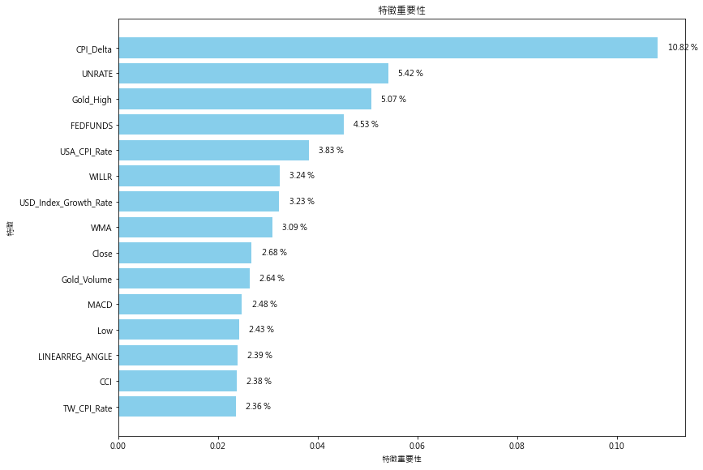

# NKUST_AI_fintech_project_II
 自專案 [NKUST_AI_fintech_project](https://github.com/Li732375/NKUST_AI_fintech_project) 延伸探索。
 ## 基本資訊
 + 目標
	+ 選用模型 XGBoost 進行美金兌台幣的漲跌預測（僅預測 漲 / 跌）
 + 資料來源
	+ 套件 yfinance
	+ 台灣消費者物價指數及其年增率 https://ws.dgbas.gov.tw/001/Upload/463/relfile/10315/2414/cpispl.xls
	+ 台灣基準利率 https://www.cbc.gov.tw/tw/public/data/a13rate.xls
+ 顯卡: NVIDIA GeForce RTX 3070 Laptop GPU
```
CMD > nvidia-smi --version

NVIDIA-SMI version  : 560.94
NVML version        : 560.94
DRIVER version      : 560.94
CUDA Version        : 12.6
```
+ 環境編輯器: Spyder IDE 5.5.5 (standalone)，Python 3.12.4 
***

## 大綱
#### [前置準備](#前置準備-1)
#### [數據選用](#數據選用-1)
#### [資料下載](#資料下載-1)
#### [資料預處理](#資料預處理-1)
#### [訓練模型](#訓練模型-1)
#### [結語](#結語-1)
***

## 前置準備

* #### 套件安裝
  對於初來乍到的讀者，為了維持你想實作的**耐心籌碼**，將相關的套件先行安裝好，可以減少很多不必要的衍伸報錯，造成籌碼提前耗損。
  > 出現難以解開的問題時，也可以早點放棄 ? (誤

  使用 pip 安裝這些套件，或者直接將 requirements.txt 文件打開直接逐一套件複製出來，再自行安裝也行，也可以照如下步驟一次安裝：
  1. 打開命令提示字元。
  
  2. 使用命令 cd 來切換目錄，到存放 requirements.txt 文件的目錄。
  3. 在目錄中執行以下命令安裝套件：
  
  ```
  pip install -r requirements.txt
  ```

  或者
  
  2. 複製 requirements.txt 文件的路徑。
  3. 在目錄中執行以下命令安裝套件：
  
  ```
  pip install -r 文件的路徑
  ```
> 不想裝 Anaconda 僅有 Spyder，還可以直接共用原來的套件庫？[看這裡](https://youtu.be/miJOoagmWAw?feature=shared) 
***

* #### yfinance
  yfinance 是一個從 Yahoo Finance 獲取財務數據的 Python 庫，特別適合進行股市、外匯等數據的抓取和分析。
  
  功能：
  1. 獲取股票、基金、ETF、外匯等資產的歷史數據
  2. 提取公司基本訊息、財務報表
  3. 支援多支股票數據下載
  4. 產生利於分析的 pandas DataFrame

***

* #### TA_Lib
  TA-Lib（Technical Analysis Library）是專門用於技術分析的 Python 庫，包含多種常見的技術指標，如移動平均線（SMA）、相對強弱指標（RSI）、布林帶等。這對於進行股票、外匯等金融市場的技術分析非常有用。本專案使用 TA-Lib 進行技術指標計算來輔助決策，產生特徵。
  
  功能：
  1. 多種技術指標：超過 150 種技術指標和數學運算工具
  2. 高效運算：基於 C 語言的實現，運算性能極高
  3. 簡單整合：可以與 pandas、numpy 等數據科學工具無縫整合
  
***

## 數據選用
在與 ChatGPT 交流後，整理出以下可量化的影響因素：
* #### 美元兌台幣影響因素

  1. 經濟基本面
     - **經濟增長率**：可以通過國內生產總值（GDP）增長率來量化。這些數據通常由國家統計局或國際組織（如世界銀行、國際貨幣基金組織）提供。
     - **通膨率**：通膨率可以透過消費者物價指數（CPI）來量化。CPI 是衡量一籃商品和服務價格變化的指標。
     - **利率**：中央銀行的政策利率（如美國聯邦基金利率、台灣的基準利率）是可量化的。這些數據由中央銀行公布。
  2. 貨幣政策
     - **中央銀行政策**：可以量化的指標包括利率變化幅度和中央銀行的貨幣政策聲明。利率的變化可以在利率公告和政策報告中找到。
     - **市場預期**：可以通過期貨市場的利率期貨合約、中央銀行的政策預期調查等來量化市場對未來貨幣政策的預期。
  3. 國際貿易
     - **貿易平衡**：貿易順差或逆差可以通過貿易帳戶數據來量化。這些數據顯示了國家出口與進口之間的差異。
     - **進出口數據**：可以通過詳細的進出口數據來量化，包括進口和出口的貨物和服務的金額。
  4. 政治與地緣政治風險
     - **政治穩定性**：雖然政治穩定性本身難以量化，但可以通過投資風險指數、政治風險報告和信用評級機構的評級來間接衡量。
     - **地緣政治事件**：可以通過事件發生的頻率和影響程度來量化，如影響經濟和市場的重大事件和新聞。
  5. 市場情緒與投資者行為
     - **投資者情緒**：可以通過市場情緒指數（如消費者信心指數、投資者情緒指數）來量化。
     - **資本流動**：可以通過資本流入流出數據來量化，例如外國直接投資（FDI）和投資組合資本流動數據。
  6. 美元指數（DXY）
     - **美元指數**：美元指數本身就是一個量化的指標，衡量美元對一籃主要貨幣的價值。這個指數可以從金融市場數據提供商獲得。
  7. 國際經濟環境
     - **全球經濟狀況**：透過全球經濟增長率、全球市場指數（如 MSCI 全球指數）來量化。這些數據來自國際經濟組織和金融機構。
  8. 國際資本流動
     - **外匯儲備**：中央銀行的外匯儲備數據是可量化的，這些數據通常由各國中央銀行或國際金融機構提供。

* #### 選用的量化數據
  1. 美元兌台幣歷史走勢
  2. 美國和台灣的通膨率
  3. 美國和台灣的中央銀行利率
  4. 美國和台灣的 CPI、GDP
  5. 美國和台灣的失業率
  6. 美元指數與其成長率
  7. 黃金價格數據

***

## 資料下載

* #### 取得歷史數據

  在 "資料下載.py" 裡，以 **美元兌台幣歷史走勢** 為例，先行匯入套件取得歷史相關數據。
  > 綜合多項數據比對，考量部分資料對於更早的時間並未有記錄，加上後續資料預處理時也須相對提前時間（這裡抓一年），因此起始時間 Data_Time_Start 固定於 2003-01-01。
  ```
  import yfinance as yf
  import matplotlib.pyplot as plt
  import pandas as pd
  
  Data_Time_Start = '2003-01-01' # 應後續特徵處理時避免缺值，必須再提前目標一年
  Data_Time_End = '2023-12-31'
  DataFolder = 'Ori_Data/'
  
  
  Currency_symbol = 'TWD%3DX' # 輸入股票代號下載匯率資料
  Currency_data = yf.download(Currency_symbol, 
                              start = Data_Time_Start, end = Data_Time_End) # 獲取特定日期範圍的匯率資料  
  ```
  > `DataFolder = 'Ori_Data/'` 這裡是自定義的資料夾名稱，用來集中原始數據。
  
* #### 代號取得？

  前往 [Yahoo Finance 網站（英）](https://finance.yahoo.com/)的貨幣（Currencies）區，點選任一貨幣歷史資料（如[日幣 JPY](https://finance.yahoo.com/quote/JPY%3DX/history/)），可以留意到，此時的網址

  `https://finance.yahoo.com/quote/JPY%3DX/history/`
  
  而前往 [外匯- Yahoo奇摩股市（中）](https://tw.stock.yahoo.com/currencies/) 點選 [美元/新台幣](https://tw.stock.yahoo.com/quote/USDTWD=X)，雖然不提供歷史數據，網址

  `https://tw.stock.yahoo.com/quote/USDTWD=X`

  因此，假定 "新台幣" 對應網址內容 "TWD"，那麼調整網址並嘗試

  `https://finance.yahoo.com/quote/TWD%3DX/`

  果然，該確定網址有效後，那就如法炮製網址，取得歷史數據

  `https://finance.yahoo.com/quote/TWD%3DX/history/`

  網址一樣有效，猜出 "**貨幣代號**%3DX" 即為該貨幣兌美元的 **代號**！
  
  
* #### 儲存原始數據

  保留最原始完全未更動的數據（儲存為 Excel 檔案）至資料夾 `Ori_Data`，供後續的預處理流程。
  ```
  excel_filename = f'USDto{Currency_symbol[:3]}_Currency_Data.xlsx' # 將匯率資料儲存為 Excel 檔案，以匯率代號作為檔案名稱
  Currency_data.to_excel(DataFolder + excel_filename)
  print(f"匯率資料已儲存至 '{DataFolder + excel_filename}'")
  print(Currency_data.head())
  ```
* #### 繪製圖表

  原始數據可視化。
  ```
  # 顯示數據
  Currency_data['Close'].plot() # 畫出圖形
  plt.xlabel("Date") # x 軸標題
  plt.ylabel("Closing Price") # y 軸標題
  plt.title("USD -> TWD") # 圖標題
  plt.show()
  ```
  
  > 這裡的圖片並未寫入儲存，是作者使用 spyder 時，右鍵另存的。
  > 後續繪製其他數據時，別忘記也要更新資料物件、兩軸名稱、標題名稱。
  
* #### 網址數據

  以台灣 **消費者物價指數及其年增率** 為例，須參考網址數據的副檔名（**.xls**），找到相應套件的讀取。並且尋找目標欄位，也要進行時間換算，或甚至是自行產生新欄位（即接下來的預處理階段）。
  > 一般來說，在目標網站的數據下載頁面，將游標移至下載按鈕上（不點擊），浮出的網址即是目標下載網址（或者是右鍵複製網址）。但也有部分網站對此做出保護，拒絕提供下載網址複製！
  ```
  # 消費者物價指數及其年增率 網址
  url = 'https://ws.dgbas.gov.tw/001/Upload/463/relfile/10315/2414/cpispl.xls'
  
  # pip install xlrd
  # 直接從 URL 讀取 excel 文件
  TW_cpi = pd.read_excel(url, header = 2) # 指定第三行（索引為2）作為欄位名稱
  print(TW_cpi.columns) # 檢視所有欄位
  
  TW_cpi = TW_cpi.drop(columns = ['累計平均']) # 移除該欄位
  TW_cpi = TW_cpi[:-4] # 移除最後四筆資料
  print(TW_cpi.head())
  
  # 轉換為長格式。將指定列變成行，並且通常是將多個列的數據合併成少數幾列
  TW_cpi = TW_cpi.melt(id_vars = '民國年', var_name = '月份', 
                       value_name = 'CPI')
  
  # regex 參數的預設值是 True，會將要替換的字串視為正則表達式處理。
  TW_cpi['月份'] = TW_cpi['月份'].str.replace('月', '', regex = False) # 轉換月份
  
  # print(TW_cpi[TW_cpi.isna().any(axis = 1)]) # 顯示缺失值資料
  TW_cpi['西元年'] = TW_cpi['民國年'] + 1911
  TW_cpi = TW_cpi.drop(columns = ['民國年']) # 移除該欄位
  TW_cpi['DATE'] = TW_cpi['西元年'].astype(str) + '/' + TW_cpi['月份'] + '/1  00:00:00' # 合併兩時間為新欄位
  TW_cpi['DATE'] = pd.to_datetime(TW_cpi['DATE'], format = '%Y/%m/%d %H:%M:%S', 
                                   errors = 'coerce') # 將 'date_str' 欄位轉換為時間格式
  TW_cpi = TW_cpi.drop(columns = ['西元年', '月份']) # 移除該欄位
  TW_cpi = TW_cpi.set_index(['DATE']) # 設定索引
  TW_cpi = TW_cpi.sort_index()
  TW_cpi = TW_cpi.loc[Data_Time_Start : Data_Time_End]
  TW_cpi['TW_CPI_Rate'] = TW_cpi['CPI'].pct_change() # 算出增長率
  print(TW_cpi.head())
  ```
  如此逐項下載並繪圖預覽～
  > 在檔案 "**資料下載2.py**" 裡，也是用同樣方式取得最新近期資料（2024-01-01 ~ 至昨天(含)）。
***

## 資料預處理

接著，在 "**資料特徵處理.py**" ，進行資料的：
1. 讀入
2. 新增技術指標
3. 合併多項不同數據來源成為訓練資料
4. 指定資料時段
5. 新增輸出欄位（訓練資料答案）
6. 儲存訓練資料

* #### 讀入數據
  從歷史貨幣數據開始，讀入 excel (.xlsx)，並且分配欄位予四個變數，供下一節使用。
  > 這裡讀入的數據，會在最後一節重新寫入新的 excel (.xlsx)，不會影響原先的原始數據。
  ```
  import pandas as pd
  import talib


  DataFolder = 'Ori_Data/'
  Currency_data = pd.read_excel(DataFolder + 'USDtoTWD_Currency_Data.xlsx', 
                              index_col = 'Date')  # 讀取匯率資料
  Currency_data.drop(columns = ['Adj Close'], inplace = True)
  df_open = Currency_data['Open']
  df_close = Currency_data['Close']
  df_high = Currency_data['High']
  df_low = Currency_data['Low']
  ```

* #### 選用與新增技術指標
  指標選用的部分，其實仰賴相對熟悉該領域的老手或者網路教學資料了，作者查詢後，似乎概念和股票相仿。參數部分幾乎仰賴預設值。
  > 匯率數據不提供交易量
  
  採納以下指標：
  1. MA (5、10、20 日)
  2. RSI (14 日)
  3. MACD
  4. KD
  5. Bollinger Bands
  6. CCI
  7. MOM
  8. BOP
  9. WILLR
  10. SAR
  11. AVGPRICE
  12. WCLPRICE
  13. LINEARREG_ANGLE
  14. WMA
  15. STDDEV
  16. CDL3BLACKCROWS
  
  ```
  # 處理 x 資料
  Currency_data['MA_5'] = talib.SMA(df_close, 5) # 計算 MA5
  Currency_data['MA_10'] = talib.SMA(df_close, 10) # 計算 MA10
  Currency_data['MA_20'] = talib.SMA(df_close, 20) # 計算 MA20
  Currency_data['RSI_14'] = talib.RSI(df_close, 14) # 計算 RSI
  macd, macdsignal, macdhist = talib.MACD(df_close, fastperiod = 12, 
                                        slowperiod = 26, 
                                        signalperiod = 9) # 計算 MACD
  Currency_data['MACD'] = macd # 將 MACD 計算結果存回資料中
  Currency_data['K'],  Currency_data['D'] = \
    talib.STOCH(df_high, df_low, df_close, fastk_period = 14, 
                slowk_period = 14, slowd_period = 3) # 計算 KD

  upperband, middleband, lowerband = talib.BBANDS(df_close, 
                                          timeperiod = 5, 
                                          nbdevup = 2, nbdevdn = 2, 
                                          matype = 0)
  Currency_data['Bollinger Bands Upper'] = upperband
  Currency_data['Bollinger Bands Middle'] = middleband
  Currency_data['Bollinger Bands lower'] = lowerband
  Currency_data['CCI'] = talib.CCI(df_high, df_low, df_close, timeperiod = 14)
  Currency_data['MOM'] = talib.MOM(df_close, timeperiod = 10)
  Currency_data['BOP'] = talib.BOP(df_open, df_high, df_low, df_close)
  Currency_data['WILLR'] = talib.WILLR(df_high, df_low, df_close, 
                                     timeperiod = 14)
  Currency_data['SAR'] = talib.SAR(df_high, df_low)
  Currency_data['AVGPRICE'] = talib.AVGPRICE(df_open, df_high, df_low, df_close)
  Currency_data['WCLPRICE'] = talib.WCLPRICE(df_high, df_low, df_close)
  Currency_data['LINEARREG_ANGLE'] = talib.LINEARREG_ANGLE(df_close, 14)
  Currency_data['WMA'] = talib.WMA(df_close,30) # 計算 MA5
  Currency_data['STDDEV'] = talib.STDDEV (df_close, timeperiod=5, nbdev=1)
  Currency_data['CDL3BLACKCROWS'] = talib.CDL3BLACKCROWS (df_open, df_high, 
                                                        df_low, df_close)
  ```
  
* #### 合併資料
  接著仿資料庫形式，逐一合併其他調整後的數據。
  
  逐一讀入其他數據
  ```
  # 讀入其他資料進行合併
  Fed_Funds_Rate = pd.read_excel(DataFolder + 'Fed_Funds_Rate.xlsx')  
  USA_CPI = pd.read_excel(DataFolder + 'USA_CPI_Data.xlsx')  
  USA_Unemployment_Rate = pd.read_excel(DataFolder + 'USA_Unemployment_Rate.xlsx')  
  TW_CPI = pd.read_excel(DataFolder + 'TW_CPI.xlsx')
  USA_GDP = pd.read_excel(DataFolder + 'USA_GDP.xlsx')
  TW_Rate = pd.read_excel(DataFolder + 'TW_Rate.xlsx')
  DXY_NYB = pd.read_excel(DataFolder + 'Dx-y_Data.xlsx')
  GOLD_data = pd.read_excel(DataFolder + 'Gold_Data.xlsx')
  ```

  > merge_asof，用於合併兩個數據框（DataFrame） ，其中一個 DataFrame 的時間戳（或排序列）可能在另一個 DataFrame 中找不到完全對應的記錄。這時，可以根據時間戳的前向或後向對齊進行合併。
  ```
  df_merge = pd.merge_asof(Fed_Funds_Rate.sort_values('DATE'), 
                         USA_CPI.sort_values('DATE'), on = 'DATE') # 合併資料
  df_merge = pd.merge_asof(df_merge.sort_values('DATE'), 
                         USA_Unemployment_Rate.sort_values('DATE'), 
                         on = 'DATE') # 合併資料
  ```

  > 部分數據則需要先行調整欄位名稱才可以對應
  ```
  TW_CPI = TW_CPI.rename(columns = {'CPI': 'TW_CPI'}) # 欄位名稱調整
  df_merge = pd.merge_asof(df_merge.sort_values('DATE'), 
                         TW_CPI.sort_values('DATE'), on = 'DATE') # 合併資料

  USA_GDP = USA_GDP.rename(columns = {'GDP': 'US_GDP'}) # 欄位名稱調整
  df_merge = pd.merge_asof(df_merge.sort_values('DATE'), 
                         USA_GDP.sort_values('DATE'), on = 'DATE') # 合併資料

  df_merge = pd.merge_asof(df_merge.sort_values('DATE'), 
                         TW_Rate.sort_values('DATE'), on = 'DATE') # 合併資料


  DXY_NYB = DXY_NYB.rename(columns = {'Date': 'DATE', 'Close': 'USD_Index', 
                                    'Growth Rate': 'USD_Index_Growth_Rate'}) # 美元指數小寫改大寫
  df_merge = pd.merge_asof(df_merge.sort_values('DATE'), 
                         DXY_NYB.sort_values('DATE'), on = 'DATE') # 合併資料

  GOLD_data = GOLD_data.rename(columns = {'Date': 'DATE', 'Open': 'Gold_Open', 
                                        'High': 'Gold_High', 
                                        'Low': 'Gold_Low', 
                                        'Close': 'Gold_Close',
                                        'Adj Close': 'Gold_Adj_Close',
                                        'Volume': 'Gold_Volume',
                                        'Growth Rate': 'Gold_Growth_Rate'}) # 黃金改大寫
  df_merge = pd.merge_asof(df_merge.sort_values('DATE'), 
                         GOLD_data.sort_values('DATE'), on = 'DATE') # 合併資料

  Currency_data = Currency_data.reset_index()
  Currency_data = Currency_data.rename(columns = {'Date': 'DATE'})
  df_merge = pd.merge_asof(Currency_data.sort_values('DATE'), 
                         df_merge.sort_values('DATE'), on = 'DATE') # 合併資料
  ```

  > 若有自行想增添的欄位（或者部分欄位有待數據引入後才可以計算），也可以如下撰寫
  ```
  # 計算兩筆資料間差距 (前後或者上下之間)
  df_merge['FEDFUNDS_Delta'] = df_merge['FEDFUNDS'].pct_change(periods = 21)
  ```
  
* #### 指定資料時段
  這裡要先指定時間段主要是考量當資料龐大時，統一算完再行裁切的話，會造成過去的處理內容白費，因此先行裁切再行處理（有關要向前捕捉的資料，只要讀進來的原始數據存在，就不影響處理）。
  
  ```
  # 因資料特定欄位計算有回朔需求而向前推進抓取時間，設定要排除的期間
  end_date = '2019-12-31' # 2019-12-31

  # 排除特定期間內的數據
  df_merge.set_index('DATE', inplace = True)
  df_merge.drop(df_merge.loc[:end_date].index, inplace = True)

  # 計算差距欄位 (欄位之間)
  df_merge['CPI_Delta'] = df_merge['CPIAUCNS'] - df_merge['TW_CPI'] # 兩國 CPI 差距

  # 移除無用欄位
  df_merge = df_merge.drop(columns = ['Volume', 'BOP', 'CDL3BLACKCROWS', 
                                    'Gold_Adj_Close'])
  ```
  > `df_merge.drop(df_merge.loc[:end_date].index, inplace = True)` 這裡的變數 `end_date` 是移除指定時間 "**之前**" 的所有資料。
  
* #### 新增輸出欄位
  由於是採**監督式學習**，所以必須要有答案供機器學習參照。
  > 在此之前，所有欄位都是作為輸入模型的**特徵**。
  
  ```
  # 處理 y 資料
  pre_day = 2
  df_merge[f'Next_{pre_day}Day_Return'] = \
    df_merge['Close'].diff(pre_day).shift(-pre_day) # 計算價格變化
  # =============================================================================
  # diff 函數，計算列中相鄰元素之間的差異。計算當前值與前指定時間點的值（pre_day）的差
  # shift 函數﹑移動要指定哪個目標資料，負數表示向上移動，反之向下
  # =============================================================================

  def classify_return(x):
    return 1 if x > 0 else 0  # 標示漲跌，大於 0 標示為漲(1)，小於 0 標示為跌(0)

  df_merge['LABEL'] = \
    df_merge[f'Next_{pre_day}Day_Return'].apply(
        classify_return) # 創造新的一列 LABEL 來記錄漲跌
  ```
  按作者經驗（後續章節圖表會顯示），先抓預測兩天後的準確率最佳。
  
* #### 儲存訓練資料
  再次檢視處理後的內容，確認無誤後就可以 `df_merge.to_excel("data.xlsx")` 另存成 excel (.xlsx)。
  
  ```
  print(df_merge.head())
  print(df_merge.tail())
  df_merge.to_excel("data.xlsx") # 將整理好的資料存成 excel
  print(f"訓練資料期間 【{str(df_merge.index[0])[:10]} - {str(df_merge.index[len(df_merge) - 1])[:10]}】")
  print("已將結果寫入檔案 data.xlsx")

  ones_count = (df_merge['LABEL'] == 1).sum()
  zero_count = (df_merge['LABEL'] == 0).sum()
  print(f"上漲數為 {ones_count} ({ones_count / df_merge['LABEL'].count() * 100:.1f} %)")
  print(f"下跌數為 {zero_count} ({zero_count / df_merge['LABEL'].count() * 100:.1f} %)")
  print(f"總特徵數為 {len(df_merge.columns)}")
  ```
  如此一來，完成訓練模型的資料準備啦～
  > 在檔案 "**資料特徵處理2.py**" 裡，也是用同樣方式預處理近期資料（2024-01-01 ~ 至今）。

***
  
## 訓練模型
  
* #### 模型與預測日數影響？
  在原始專案 "**NKUST_AI_fintech_project**" 裡，簡報最後提到，準確率會隨預測日數拉長而提升。

  |原始資料圖 （30 天）|新資料圖（60 天）|
  |:-:|:-:|
  |||

  > 左圖水平軸少一天。但三年資料量線型整體看起來不變，並且在 30 天後走向穩定。
  
  即便調整資料量（增加時間），準確率變化幅度也只是隨資料量上升趨於穩定，大致趨勢不變。

  |近一年|近兩年|
  |:-:|:-:|
  |||

  |近五年|近十八年|
  |:-:|:-:|
  |||

  > 2005 至 2006 5月中的資料有不明遺失，但在此之前之後的資料都正常。

* #### 逐步上升的真相

  然而，實際上，執行 "**預測日數和準確率繪圖2.py**" 後，會得到如下圖片：

  

  > 2005 至 2006 5月中的資料有不明遺失，但在此之前之後的資料都正常。

  > 所謂無效資料，源自倒數**指定天數**數量的資料因無法得知，導致資料有固定數量缺失。近期資料自 2024 年元旦始至執行前一日（含），占據所有近期資料的比例會隨著越晚執行，占比逐漸降低
  
  即便再次拉長預測天數至百日，測試集也不會再有更高突破，但**在無效資料（紅線）占比超過 30% 之後**，即便採近期資料作測試集，也有顯著上升一個階級！

  > 這也是為何預測天數控制在 2 天！！！
  
* #### 訓練模型
  
本專案採用 XGBoost 訓練模型，並且在取得前 15 名重要特徵後，依據指定特徵，設定四種訓練策略：
1. 整批訓練：一般常見形式，將分割好的訓練集資料集全部賦予同一模型訓練
2. 批次分段再訓練：將分割好的訓練集資料集再分批，分別賦予同一模型訓練
3. 批次分段各別訓練：將分割好的訓練集資料集再分批，分別賦予不同模型訓練
4. 批次分段增量再訓練：將分割好的訓練集資料集再分批，但每批會涵蓋前一批內容，分別賦予同一模型訓練
  
* #### 特徵重要性檢視
  
  在檔案 "**xgboost訓練範例.py**" 裡，將訓練資料 "data.xlsx" 讀入，訓練模型後，取得特徵重要度排名。
  
  1. 讀入資料
     ```
     import pandas as pd
     from sklearn.model_selection import train_test_split
     from xgboost import XGBClassifier
     
     df = pd.read_excel('data.xlsx', index_col = 'DATE')
     ```

  2. 分割訓練與測試集
     
     > 其實，由於這次採納的資料屬於時間序列資料（隨著時間順序收集的數據，表示某個變量在不連續或連續的時間點上的變化，連續資料之間具趨勢且順序不可異動（要嘛涵義有別、要不就是無效數據），像音樂、氣溫、股價、心跳），而 `train_test_split` 更常應用於橫斷面資料（Cross Section Data）的數據。
     > 例如你買西瓜時，不會因為隔天就變成橘子，但股價會變。
     ```
     def split_stock_data(stock_data, label_column, delete_column, test_size = 0.3, 
                      random_state = 42):
     
	 X = stock_data.drop(delete_column, axis = 1)
    	 feature_names = X.columns.tolist()
    	 y = stock_data[label_column].values
     
    	 X_train, X_test, y_train, y_test = train_test_split(X, y, 
                                                        test_size = test_size, 
                                                        random_state = 
                                                        random_state) # 資料分割
     
     	 return X_train, X_test, y_train, y_test, feature_names
      
     label_column = 'LABEL' # 標籤欄位
     # 刪除的欄位，欄位 'Next_?Day_Return' 中，? 應視特徵處理檔案參數 pre_day 調整
     delete_column = ['LABEL', 'Next_2Day_Return']
     
     # 切分資料為訓練與測試集
     trainX, testX, trainY, testY, feature_names = split_stock_data(df, label_column, 
                                                delete_column)
     ```
     
  3. 訓練模型

     > `import time` 僅僅只是計時用，紀錄模型訓練時間。
     ```
     import time

     Xgboost = XGBClassifier()
     start_time = time.time()
     Xgboost.fit(trainX, trainY)
     training_time = time.time() - start_time
     
     test_predic = Xgboost.predict(testX) # 取得預測的結果
     test_acc = Xgboost.score(testX, testY)
     print('Xgboost測試集準確率 %.2f' % test_acc)
     ```
     
  4. 繪製特徵重要性圖表
     ```
     # 繪製特徵重要性圖
     import matplotlib.pyplot as plt
     
     # 將特徵名稱和重要性配對
     feature_importance_pairs = list(zip(feature_names, 
                                    Xgboost.feature_importances_))
     
     sorted_pairs = sorted(feature_importance_pairs, key = lambda x: x[1], 
                      reverse = True)
     
     # 提取排序後的特徵
     sorted_feature_names, sorted_importances = zip(*sorted_pairs[:]) # [:數字] 取得前幾名的特徵和重要性
     print("依特徵重要性排序")
     print(sorted_feature_names)
     print()
     
     for i, j in zip(sorted_feature_names, sorted_importances):
         print(f"{i} ({j * 100:.2f} %)")
     print()
     
     # 繪製特徵重要性橫條圖
     plt.rcParams['font.family'] = 'Microsoft JhengHei' # 設置中文字體
     plt.figure(figsize = (12, 8))
     bars = plt.barh(sorted_feature_names, sorted_importances, color = 'skyblue')
     
     # 顯示每個橫條的數值
     for bar in bars:
         width = bar.get_width()
         plt.text(width + 0.002, bar.get_y() + bar.get_height() / 2, 
             f'{width * 100:.2f} %', 
             va = 'center', ha = 'left', fontsize = 10)
         
     plt.xlabel('特徵重要性')
     plt.ylabel('特徵')
     plt.title('特徵重要性')
     plt.tight_layout(pad = 0.5)
     plt.gca().invert_yaxis()  # 反轉 y 軸，使重要性高的特徵顯示在上面
     plt.show()
     
     
     print(f"測試時間: {training_time:.2f} 秒")
     print(f'模型準確率為 {test_acc:.3f}')
     ```
     > `Xgboost.feature_importances_` 僅能依據原先欄位的順序（`feature_names`），取得各特徵重要性的百分比（ex: 0.123 表示重要性約 12.3 %）。
     
     > `sorted_feature_names, sorted_importances = zip(*sorted_pairs[:])` [:數字] 取得前幾名的特徵和重要性。
     
     |`[:]` (全部特徵)|`[:15]` (前 15 名特徵)|
     |:----------:|:----------:|
     |||

     輸出結果（前 15 名）
     > 為何取前 15 名？原因無它，只是大概的取到重要性變化幅度初步進入平緩的區間而已...呵呵
     ```
     Xgboost測試集準確率 0.70
     依特徵重要性排序
     ('CPI_Delta', 'UNRATE', 'Gold_High', 'FEDFUNDS', 'USA_CPI_Rate', 'WILLR', 'USD_Index_Growth_Rate', 'WMA', 'Close', 'Gold_Volume', 'MACD', 'Low', 'LINEARREG_ANGLE', 'CCI', 'TW_CPI_Rate')
     
     CPI_Delta (10.82 %)
     UNRATE (5.42 %)
     Gold_High (5.07 %)
     FEDFUNDS (4.53 %)
     USA_CPI_Rate (3.83 %)
     WILLR (3.24 %)
     USD_Index_Growth_Rate (3.23 %)
     WMA (3.09 %)
     Close (2.68 %)
     Gold_Volume (2.64 %)
     MACD (2.48 %)
     Low (2.43 %)
     LINEARREG_ANGLE (2.39 %)
     CCI (2.38 %)
     TW_CPI_Rate (2.36 %)
     
     測試時間: 0.14 秒
     模型準確率為 0.703
     ```
     > 這裡的 `模型準確率為 0.703` （取到點後 3 位），就是測試集的答對率。
     
     接著複製 `('CPI_Delta', 'UNRATE', 'Gold_High'...)`，進入下一節囉 ~

* #### 整批訓練（指定特徵）

  在檔案 "xgboost訓練/**xgboost指定特徵.py**" 裡，大致上如法炮製 ~

  1. 切割資料

     需要調整的部分，莫過於大幅減少特徵數，因此需要方才複製的指定特徵予 `feature_names`。
     ```
     import pandas as pd
     from sklearn.model_selection import train_test_split
     from xgboost import XGBClassifier
     import matplotlib.pyplot as plt
     import numpy as np
     import time
     
     
     # 讀取數據
     df = pd.read_excel('../data.xlsx')
     df_Latest = pd.read_excel("../data_Latest.xlsx")
     
     #print(df.columns)
     ...略
     
     feature_names = ['CPI_Delta', 'UNRATE', 'Gold_High', 'FEDFUNDS', 'USA_CPI_Rate', 'WILLR', 'USD_Index_Growth_Rate', 'WMA', 'Close', 'Gold_Volume', 'MACD', 'Low', 'LINEARREG_ANGLE', 'CCI', 'TW_CPI_Rate']
     # 0.821
    
     def split_stock_data(stock_data, label_column, test_size = 0.3, 
                        random_state = 42):
         X = stock_data[feature_names].values
         y = stock_data[label_column].values
         
         X_train, X_test, y_train, y_test = train_test_split(X, y, 
                                                        test_size = test_size, 
                                                        random_state = 
                                                        random_state)
  
         return X_train, X_test, y_train, y_test, feature_names

     label_column = 'LABEL'
  
     # 分割資料
     trainX, testX, trainY, testY, feature_names = split_stock_data(df, label_column)
     ```

     > `df_Latest = pd.read_excel("../data_Latest.xlsx")` 就是準備好的近期測試資料，來揭穿夢想的泡泡！
     
     > `train_test_split` 預設 `shuffle = True` ，意思會打亂分割資料集的資料順序！並不適用於時間序列資料！

  2. 取得批改結果

     將訓練完的預測結果（作答結果） `Xgboost.predict(testX)` 比對測試集答案 `testY`，存到 `xor_result` 供後續繪圖。

     >  `xor_result` 沒有按時間順序排序。
     ```
     ...略
     test_predic = Xgboost.predict(testX) # 取得預測的結果
     test_acc = Xgboost.score(testX, testY)

     # 近期數據測試
     X_Latest = df_Latest[feature_names].values
     y_Latest = df_Latest['LABEL'].values
     
     latest_data_test_acc = Xgboost.score(X_Latest, y_Latest)
     
     
     # 進行 XOR 運算
     xor_result = np.bitwise_xor(test_predic, testY)
     # =============================================================================
     # test_predic 和 testY 之間的 XOR 運算找出模型預測情況：
     # 
     # 如果 test_predic[i] 和 testY[i] 相同（即模型預測'正確'），則 XOR 結果為 0。
     # 如果 test_predic[i] 和 testY[i] 不同（即模型預測'錯誤'），則 XOR 結果為 1。
     # =============================================================================
     #print(f"結果資料型態 {type(xor_result)}")
     #print(f"結果資料筆數 {len(xor_result)}")
         
     print('Xgboost測試集準確率 %.3f' % test_acc)
     print(f"訓練時間: {training_time // 60:.0f} 分 {training_time % 60:.2f} 秒")
     
     print('Xgboost近期數據測試準確率 %.3f' % latest_data_test_acc)
     ```

  3. 繪製熱量圖

     接著嘗試繪製熱量圖
     ```
     # 這裡本圖僅參考分布，不具實際應用意義，因 train_test_split 抽選資料為隨機抽取(並不
     # 連續)，並且輸出的資料完全不可回朔，僅能自行添加欄位回朔，不利於本繪圖的時間資料。
     import matplotlib.colors as mcolors
     import matplotlib.patches as patches
     
     # 有一維的二元數據（長度不定）
     result = pd.Series(xor_result)
     
     def darw(result):
         num_columns = 5 # 每列 5 筆數據
         num_rows = (len(result) + num_columns - 1) // num_columns # 計算需要的行數
         data_padded = np.pad(result, 
                         (0, num_rows * num_columns - len(result)), 
                         mode = 'constant', constant_values = -1) # 補齊數據
    
         # 重塑為每列 5 筆數據的二維矩陣
         result_2d = data_padded.reshape(num_rows, num_columns).T  # 轉置以符合每列顯示的要求
     
         plt.rcParams['font.family'] = 'Microsoft JhengHei' # 設置中文字體
         plt.figure(figsize = (12, 6), facecolor = 'black')
         plt.xlabel("交易日（週）", fontsize = 11, color = 'white') # x 軸的標籤
         plt.title('模型預測分布情形', fontsize = 14, color = 'white', 
                   va = 'baseline')
          
         # 設定配色
         colors = ['#636363', '#00EB00', '#9c9c9c'] # 黑、綠、灰
         cmap = mcolors.ListedColormap(colors) # 自訂顏色映射:補齊、0(對) 、1(錯)
         bounds = [-1, 0, 1, 2] # -1：補齊數據, 0：原始數據, 1：補齊數據
     # =============================================================================
     #     bounds 的 2 是用來定義顏色映射的邊界範圍，並且它不會直接影響圖像中的顏色。
     # =============================================================================
         norm = mcolors.BoundaryNorm(bounds, cmap.N)
            
         # 繪製圖像
         plt.imshow(result_2d, cmap = cmap, norm = norm, interpolation = 'none', 
                    aspect = 'equal')
         
         # 繪製每個方格的邊框
         ax = plt.gca()
         num_rows, num_columns = result_2d.shape
         
         for i in range(num_rows):
             for j in range(num_columns):
                 rect = patches.Rectangle((j - 0.5, i - 0.55), 1, 1, linewidth = 1, 
                                          edgecolor = '#636363', 
                                          facecolor = 'none')
                 ax.add_patch(rect)
                      
         # 設置圖表整體邊框顏色和寬度
         for spine in ax.spines.values():
             spine.set_edgecolor('#636363')
             spine.set_linewidth(1)
         
         # 設置刻度字體大小
         plt.xticks([0] + [i for i in range(4, len(result) // 5, 5)] + \
                    [len(result) // 5] if len(result) % 5 != 0 else [], 
                    [1 if i == 0 else i for i in range(0, len(result) // 5, 5)] + \
                        [len(result) // 5 + 1] if len(result) % 5 != 0 else [], 
                    fontsize = 10, color = 'white')
         plt.yticks(range(5), ['1st', '2nd', '3rd', '4th', '5th'], 
                    fontsize = 9, color = 'white', ha = 'left')
         plt.tick_params(axis = 'y', pad = 16) # 因 ha = 'left' 時會導致重疊顯示，需校正
     # =============================================================================
     #     axis：指定軸
     #     pad：偏移量，正值左移參考軸，負值右移。pad 是刻度標籤與刻度線之間的距離
     # =============================================================================
         
         # 創建圖例框
         legend_labels = ['自動補齊', '答對', '答錯']
         legend_elements = [plt.Line2D([], [], linestyle = '-.', 
                                       color = color, 
                                       lw = 6, 
                                       label = label) for color, 
                            label in zip(colors[1:], legend_labels[1:])]
     # =============================================================================
     #     plt.Line2D：
     #     
     #     plt.Line2D([0], [0], color = color, lw = 4, label = label) 創建了一個線條對象，用於圖例。
     #     linestyle:'-', '--', '-.', ':', 'None', ' ', '', 'solid', 'dashed', 
     #     'dashdot', 'dotted'
     #     color = color 設定線條顏色。
     #     lw = 4 設定線條寬度。
     #     label = label 設定圖例標籤。
     # =============================================================================
         
         # 添加圖例
         plt.legend(handles = legend_elements, loc = 'upper left',
                    ncol = 3, bbox_to_anchor = (-0.01, 1.7), 
                    facecolor = 'black', labelcolor = 'w')
     # =============================================================================
     #     loc：圖例於圖表中的位置
     #     ncol：單一行顯示幾個標籤
     #     bbox_to_anchor：以 loc 為原點，進階調整圖例位置
     #     facecolor：圖例背景色   
     #     labelcolor：圖例統一文字顏色
     # =============================================================================
         
     darw(result[:])
     ```
     
     

     搭啦！綠色表示答對一題（某筆資料），灰色表示答錯。這個圖是不是很眼熟阿 ~

* #### 批次分段再訓練（指定特徵）

  1. 不同的切割資料方案 `TimeSeriesSplit` 

     **TimeSeriesSplit** 是 scikit-learn 中用來處理時間序列數據的交叉驗證方法，特別適合時間序列數據的特性，因為時間序列具有順序性，資料不能隨意打亂。普通的交叉驗證會隨機分割數據，而 TimeSeriesSplit 則是根據時間順序逐步將數據進行分割，確保訓練集總是在測試集之前。

     假設以下數據集：

     ```
     [1, 2, 3, 4, 5, 6, 7, 8, 9, 10]
     ```

     使用 TimeSeriesSplit，數據會被這樣分割：

     ```
     分割批次 1: Train: [1, 2], Test: [3]
     分割批次 2: Train: [1, 2, 3], Test: [4]
     分割批次 3: Train: [1, 2, 3, 4], Test: [5]
     ...略
     ```

     讀入訓練資料後如下應用，設定分割 9 份，且彼此重疊 30 %：
     
     ```
     import pandas as pd
     from sklearn.model_selection import TimeSeriesSplit
     import math
     from xgboost import XGBClassifier
     import time
     import os
     import Plot
     
     ...略
     
     n_splits = 9 # 設定分割數量
     overlap_rate = 3 * 0.1 + 1 # 設定每批訓練集之間的，最低重疊率
     max_train_size = math.ceil(len(df) // n_splits * overlap_rate) if \
         len(df) % n_splits == 0 else math.ceil(len(df) / n_splits * overlap_rate) # 計算最大訓練集大小
     print(f"最大資料長度 {max_train_size}")

     # 初始化 TimeSeriesSplit
     TSS = TimeSeriesSplit(n_splits = n_splits, max_train_size = max_train_size)
     ```

     > 不可指定訓練與測試集的占比，設定比例基本上控制在各段數據參半（先訓練集後測試集）。

  2. 分批提取
     
     ```
     # 儲存每個折的訓練集索引
     split_indices = [None for _ in range(n_splits)]
     batch_test_scores = []
     latest_test_scores = []
     
     Xgboost = XGBClassifier()
     
     # 逐步分割資料
     for i, (train_index, test_index) in enumerate(TSS.split(X, y)):
         split_indices[i] = train_index
         sub_train_index = df.iloc[train_index]
         sub_test_index = df.iloc[test_index]
         train_len = len(sub_train_index)
         test_len = len(sub_test_index)
         all_len = train_len + test_len
         
         ...略
     
         # 提取訓練集和測試集
         sub_trainX, sub_testX = X[train_index], X[test_index]
         sub_trainY, sub_testY = y[train_index], y[test_index]
     ```

     資料分割如下圖：

     

  3. 訓練模型
 
     由於是分段再訓練，會重新利用同一模型。這裡儲存模型為 `.json`。

     ```
     # 如果模型檔案存在，載入模型；否則初始化一個新模型
         if os.path.exists(f'xgboost_model_{i}.json'):
             Xgboost.load_model(f'xgboost_model_{i}.json')
             print(f'載入模型：xgboost_model_{i}.json')
         else:
             print(f'初始化新模型：xgboost_model_{i}.json')
             
         # 訓練 XGBoost 模型
         start_time = time.time()
         Xgboost.fit(sub_trainX, sub_trainY)
         training_time = time.time() - start_time
         
         # 批次測試集預測結果和模型準確率
         test_acc = Xgboost.score(sub_testX, sub_testY)
         batch_test_scores.append(test_acc)
         
         print('Xgboost測試集準確率 %.3f' % test_acc)
         print(f"訓練時間: {training_time // 60:.0f} 分 {training_time % 60:.2f} 秒")
         
         # 最新資料測試
         latest_data_test_acc = Xgboost.score(X_Latest, y_Latest)
         latest_test_scores.append(latest_data_test_acc)
         
         # 儲存當前訓練後的模型
         Xgboost.save_model(f'xgboost_model_{i + 1}.json')
     ```

     訓練成果圖：

     

* #### 批次分段各別訓練（指定特徵）

  設定分割 9 份，且彼此重疊 30 %
  
  |資料分割|訓練成果|
  |:-:|:-:|
  |||

* #### 批次分段增量再訓練（指定特徵）

  設定分割 9 份，且彼此重疊 30 %
  
  |資料分割|訓練成果|
  |:-:|:-:|
  |||

  > 嘀咕：其實這裡就不應該再設定重疊率了！

***

## 結語

儘管此專案事後重新檢視下來仍有諸多需要進步的地方，彙整如下：

1. 時間序列資料不適用 `train_test_split` 做資料分割，因為會打亂資料順序，違背時間序列特色。
2. 模型選用上，適合採納更理想的時間序列模型（ex: LSTM）。
3. 未考慮進無效資料占近期資料比例和僅透過測試集資料訓練結果，導致過於理想，但實際上看來是**過擬和**。
4. 分段增量不應再設定重疊率

* #### Plot.py
  提供相異訓練策略之間繪製圖表（資料分割圖與準確率變化圖）

* #### 特徵組合範例.py
  嘗試找出最佳特徵組合，但透過排列組合的計算就可以得知，成本過高，僅保留做範例。
  
* #### 週K與熱力對照圖範例.py
  用於將時間序列資料繪製週K圖，並在下方提供熱量圖對照，原先期待能依此辨識出訓練成效較差的資料區間，進一步篩選出較佳的 "**訓練資料**"，提升模型成效。
  
***

參考連結
+ 英，[yfinance](https://github.com/ranaroussi/yfinance)
+ 英，[TA_Lib](https://ta-lib.github.io/ta-lib-python/doc_index.html)
